# Taiyaki

***This README is intended for the Flutter variant***

## NOTE

Taiyaki is a FOSS (Free and Open Sourced Software) mobile app that allows the user to view their anime and have their data all in one place. It is built with Flutter and supports both Android and iOS platforms.

This app is not intended to be used as a piracy tool, but in fact as a means to make it safer for the average watcher from viruses, harmful advirts, and scams found on typical shady websites.

This app is free to use and will never cost the user any amount of money to use. As always please download the app on the Github site and not from any third party providers.

### ABOUT THE APP

Taiyaki lets you watch anime and sync across multiple third party trackers, such as MyAnimeList, Anilist, and SIMKL. Along with a good amount of information on the anime.

#### Features

* Sync to third party trackers: MyAnimeList, SIMKL, Anilist

* Multiple third party sources.

* Get notified when new episodes are available on sources.

* Binge watch the entire series in one spot. Once an episode ends Taiyaki will automatically play the next one for you. No extra work necessary.

* Hide unwatched episodes, to prevent any unwanted spoilers.

* See your follower's activities(Limited to Anilist only as other trackers have yet to implement it to their API. But will be updated if it ever is published).

* Having a hard time choosing what to watch next? Use the large amount of filters to pin down exactly the anime you're looking for.

If you like the app, please ⭐️  the project to show your support!

| Features  |  Screenshots - Android  | Screenshots - iOS |
|---|---|---|
| Home   | 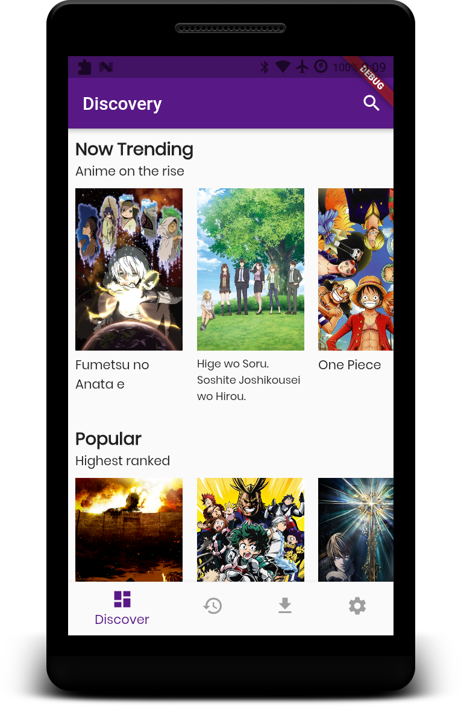  | 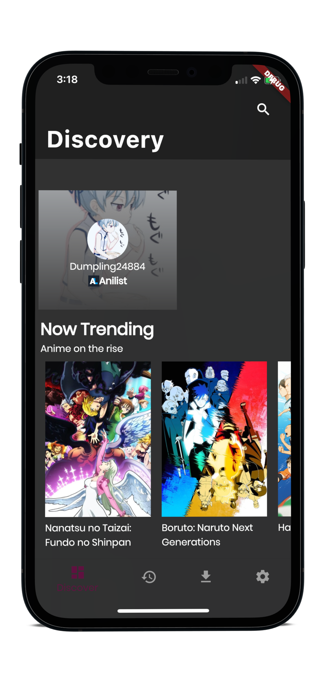 |
| Episodes | 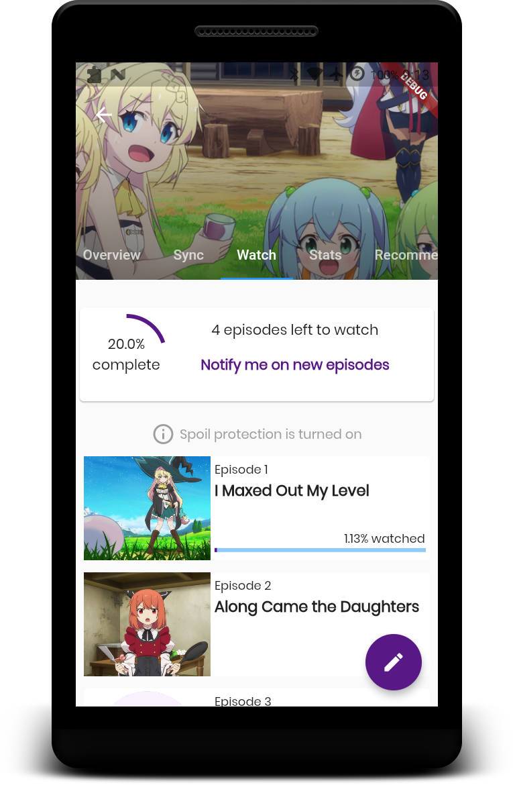  | 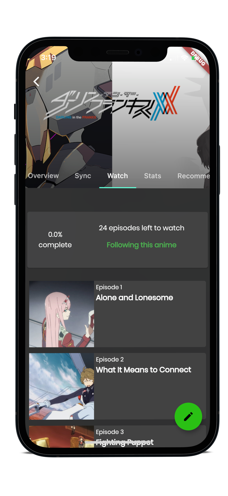 |
| Sync | 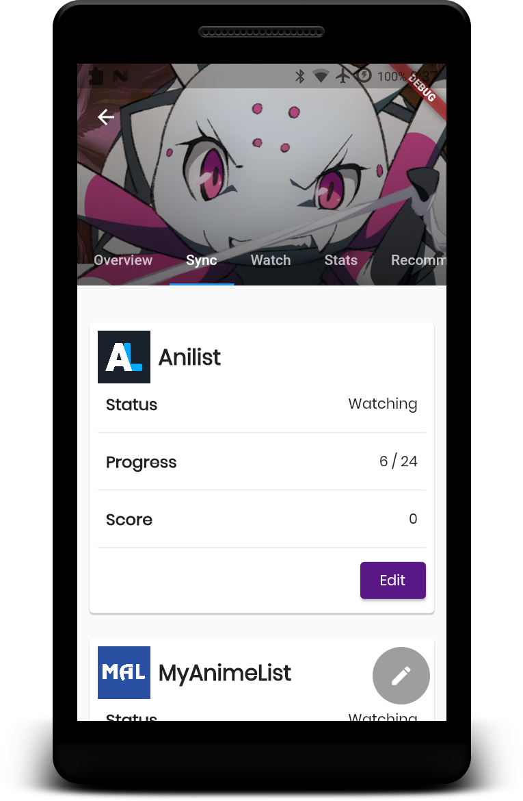  | 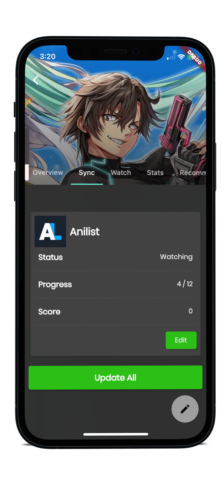 |
| Search - Filter | 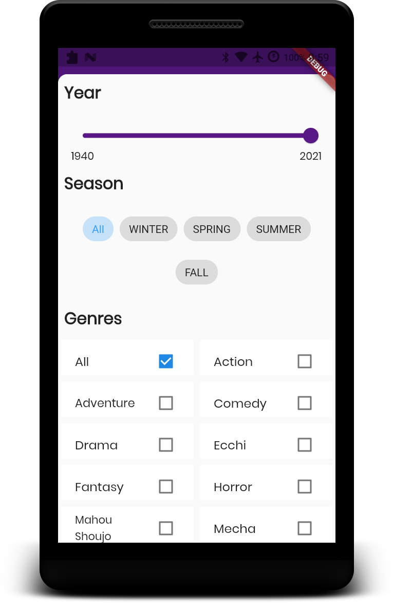  | 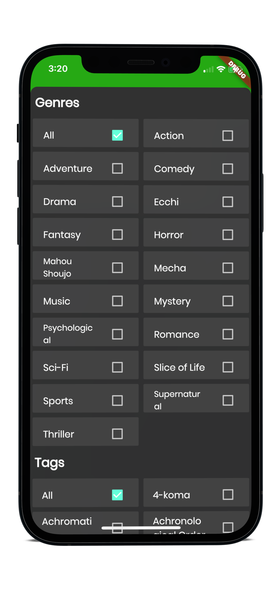 |
| Overview | 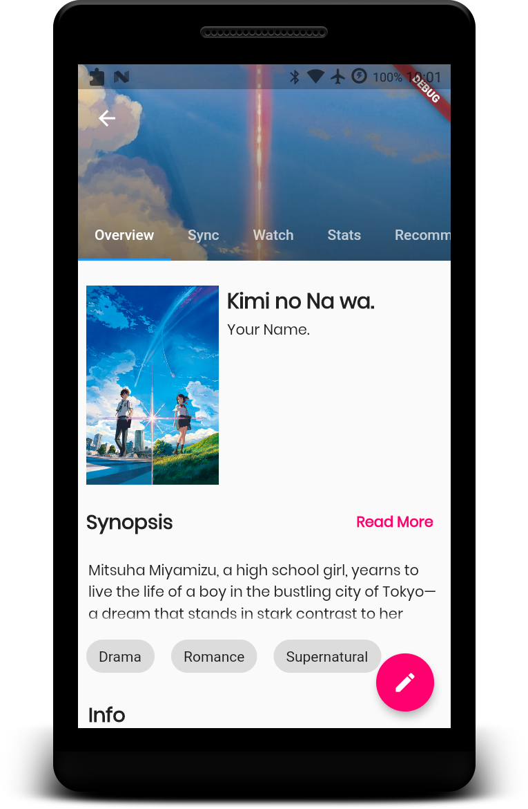 | 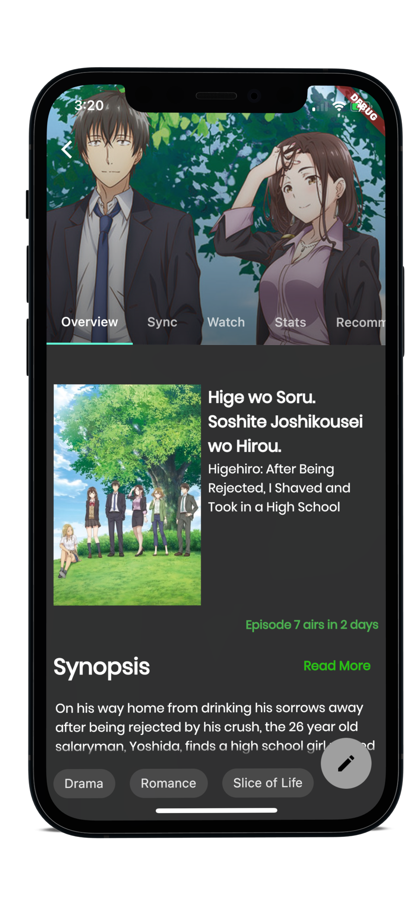 |
| Profile| 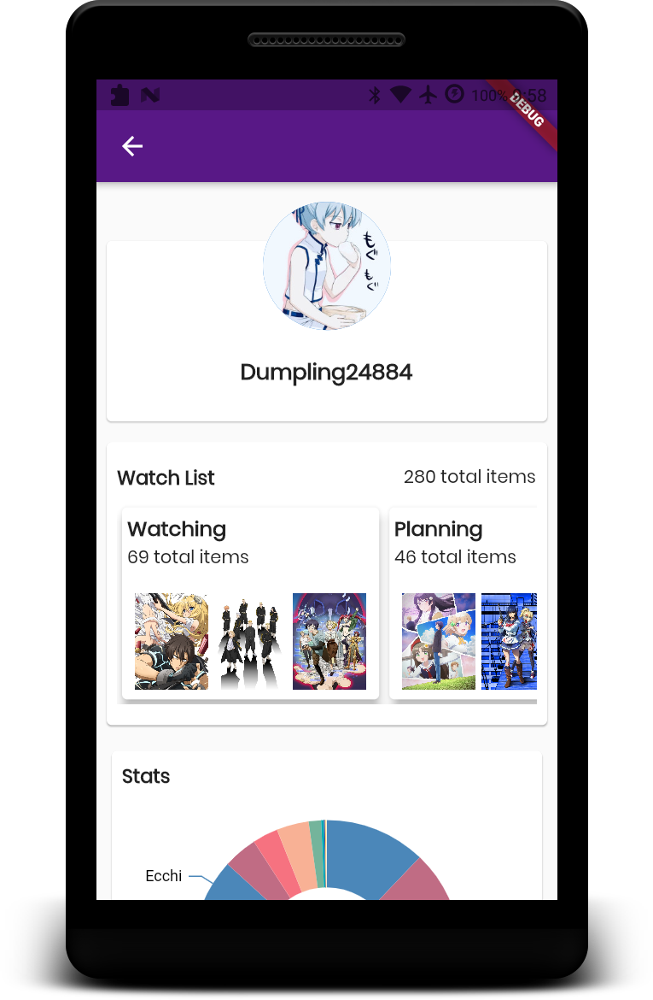 | 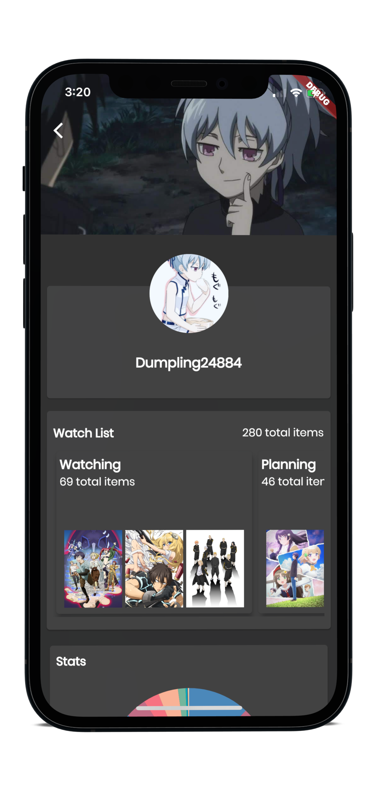 |
| Smart Playlist UI | 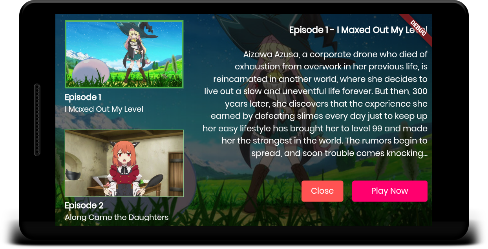|

### Contributing

Taiyaki is built by community service, help is always welcomed. If you want to help out you can fork the repository, do some work and changes on it, then create a pull request.

If instead you'd prefer to build sources and/or hosts, head into the Sources/ folder to get started on how to build one.
