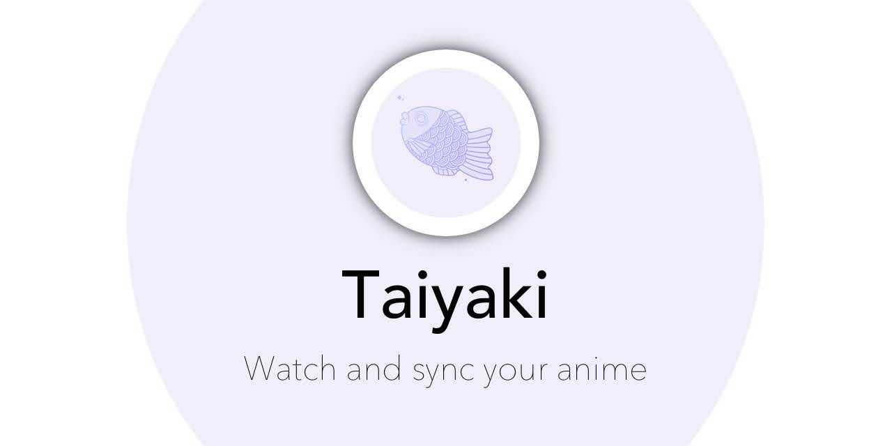

# Taiyaki

---

## Here are a few key features / previews of the Taiyaki app

|                           Home Screen                           |     Dark Version           |
| :---------------------------------------------------------------: | :-------------------------------------------------: |
|           |  |
|       Light Version                                      |      Queue Player support to binge all your anime in one sitting             |
|           |  |
|       See your third party tracker stats                        |     Spoiler-free support to prevent accidental reveals |
|           |    |
|       Multiple third party tracker support                                           |     Update all your data in one place  |
|           |   |
|       In App video player                                       |     In App video player + Up Next                   |
|          | |

(Images are on an iPhone but are the same for Android)

---

### Note: This app is not intended to promote piracy, and instead makes it safer and much more reliable for the intended user

### Please Note that Taiyaki will always remain free with no ads. If you ever encounter ads or require payment to use any part of the app, please uninstall them and report it

---

## FAQ

_Is Taiyaki legal?_

#### Yes! Taiyaki does not host any of these anime on any server, neither is it maintained. Instead Taiyaki scrapes the data of various websites, stripping the unnecessary (and sometimes harmful) ads out of the way

---

_Will Taiyaki be available for my Android TV or Desktop?_

#### As Taiyaki improves more devices will be supported. But the most certain answer would be most likely. This would be a quicker process as most of the logic is done, the layout however would have to be updated to be reflected based on the desired screen size

---

_Can I request a source?_

#### Of course! Join the Discord server and ask around to see if anyone is willing to fulfill your request. You can contribute by learning how to make one and then making it available for the rest of the community

---

_How do I report a bug?_

#### No app is perfect. If you find any bugs or something that doesn't look right, you can report this in the Discord where it would most definitely be seen. Most of the users on there should be able to help you out for any other issues that you may be having

---

_How do I contribute to Taiyaki?_

#### The source code for Taiyaki is available on Github. You can help out by forking the project, modifying, adding, or fixing up bugs, then make a pull request, and wait for it to be reviewed and merged!

---

## iOS

Taiyaki is available on TestFlight and is compatible with iPhone and iPad. TestFlight is limited to only 10,000 users

[Download on TestFlight](https://testflight.apple.com/join/MLL0nUqr "Download on TestFlight")

### Android

Taiyaki is available on all Android devices. Support for more screen sizes are arriving later on(e.g Android TV, Tablets, etc). No limit for Android users

[Download on Github](https://github.com/Michael24884/TaiYaKiAnime/releases, "Download through Github")

## TODO

- [ ] Downloads
- [ ] Increase Sources
- [ ] Prettify / Remove unnecessary code